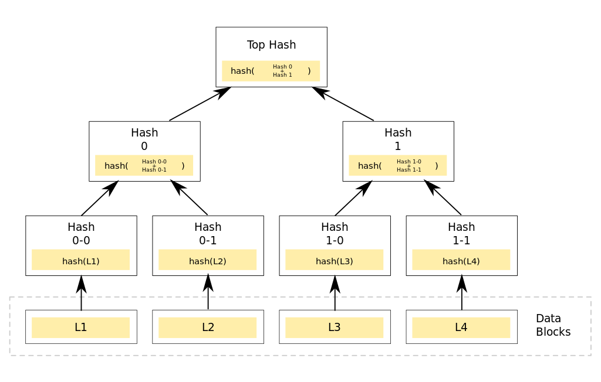

# Lamport_Signature-C

This repository is to implement some of the functionalities of the
Lamport signature discussed in the course offered by the MIT
.

I'm aiming to implement the Lamport signature using SHA-256 as hash
function and explore the risks in using the same private key for
more than one signature.

## Lamport Signature

So, the Lamport signature consists of a private key, a hash function
and a public key. The public key is generate from the private key
using a hash, and the private key is generate using a Pseudo Random
Number Generator (PRNG).

```
Section zero
private key     : [rz0] ---------- [rz1] ---------- ... ---------- [rz255]
                     |               |               |                |
hash function   : hash([rz0]) - hash([zr1]) ------- ... -------- hash([rz255])
                     |               |               |                |
public key      : [hz0] ---------- [hz1] ---------- ... ---------- [hz255]

Section one
private key     : [ro0] ---------- [ro1] ---------- ... ---------- [ro255]
                     |               |               |                |
hash function   : hash([ro0]) - hash([ro1]) ------- ... -------- hash([ro255])
                     |               |               |                |
public key      : [ho0] ---------- [ho1] ---------- ... ---------- [ho255]
```

Any hash function could be used to use this method, I've chosen the same as in the , that's, the SHA-256.

To sign a message we first hash the message and for each bit of the hash
we reveal the corresponding block.
Example: the bits of the message hashed are 1010011..., so we pass the blocks
according ([ro0], [rz1], [ro2], [rz3], [rz4], [ro5], [ro6], ...) and anyone can
check that this message originates from the same person which own that public
key.
The process to check is straightforward, each block revealed is hashed and
compared with the public key, if they do match, than the signature's valid.

## Implementation

The private key consists of 2 sections of 256 blocks of 256 bits per block,
therefore the total size in bytes of the private key is 2.256.256/8 = 16384
Bytes, and since the hash function outputs 256 bits per input we also need
to store 16384 Bytes for the public key. In total we have 32 KBytes for each
pair of keys generated.

The key struct is show below

``` c
key {
  uint8_t one[32*256];
  uint8_t zero[32*256];
};
```

The length of each block of the private key could be less than the 256 bits,
but for security reasons it shouldn't, if each block had a size of 32 bits,
for example, the public key would still have 256 bits per block, but it
would be feasible to try out all the input possibilities hashing it and compare
with the public key to find the private
key. This is called a pre-image attack, so we need to
make unrealistic to run out all the input values just as in the outputs of
the hash function.

## Exploring the bad use of Lamport signature

If the same private key is used to sign more than one message, than, it is
possible for an attacker to sign its own message pretending to be the real
owner of the key. If the messages signed were random messages than with
4 messages is already possible to forge a new message in a standard computer.
This is possible because each signature reveals parts of the private key,
colecting the blocks revealed from the signatures gives a flexibility for
an attacker to chose specific messages that use only those blocks.

## Improvement using Merkle Tree

Since is proven possible to hack a signature if the private key is used more
than once we should never do that. Therefore, if we want to sign 4 messages
we'll have to publish a 64 KB public key, and to sign a message would have to
say wich public key those blocks are refering to.
But with merkle tree we only need to publish 32 B that is our public hash key,
or root, and provide a validation methode so the verifyer can check that that
private key is indeed part of that tree.



The leafs are our key pairs, to sign a message we have to sign a message exacly
how we did before and pass the 'brother' node, so for example, we sign a message
using the L1 leaf, is necessary to pass the signature and the public key just as
the hash of L2 (node 0-1), the prover can hash the public key of L1 to find the
parent node (node 0-0) and with that he can generate the hash of node 0, but he
still needs the hash of node 1 to get to the top hash.

|Usual Lamport signature|public key|Hash 0-1|Hash 1|

One thing to consider though is that the order matters, hash(node_0, node_1) !=
hash(node_1, node_0), to solve that I added an extra byte before every hash block
to indicate wheter that hash should be in the left or in the right.

## How to used

There's a makefile here so just download the repo and to run
in the terminal just do a

``` bash
    make
    ./build/run
```

In the main file there are three different situations the first will sign and
verify a simple message, the other will sign multiple messages with the same
private key and forge another, and for last but no least a merkle tree will be
contructed and printed.
